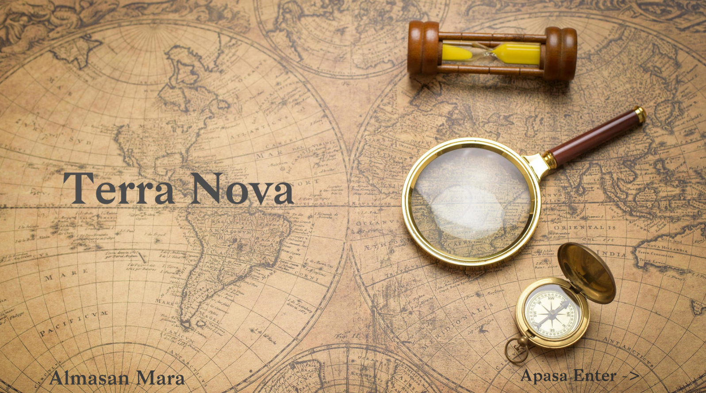
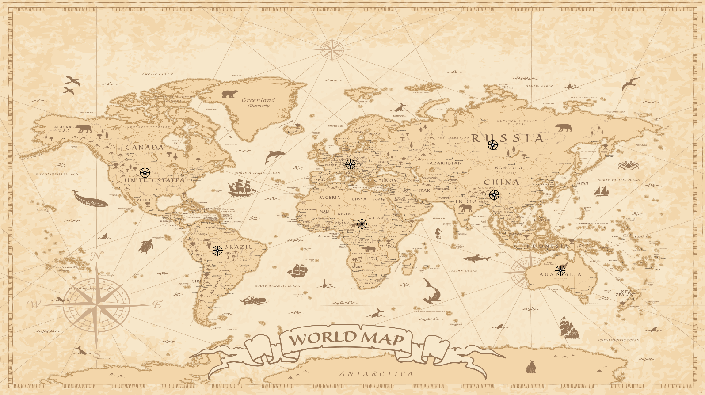
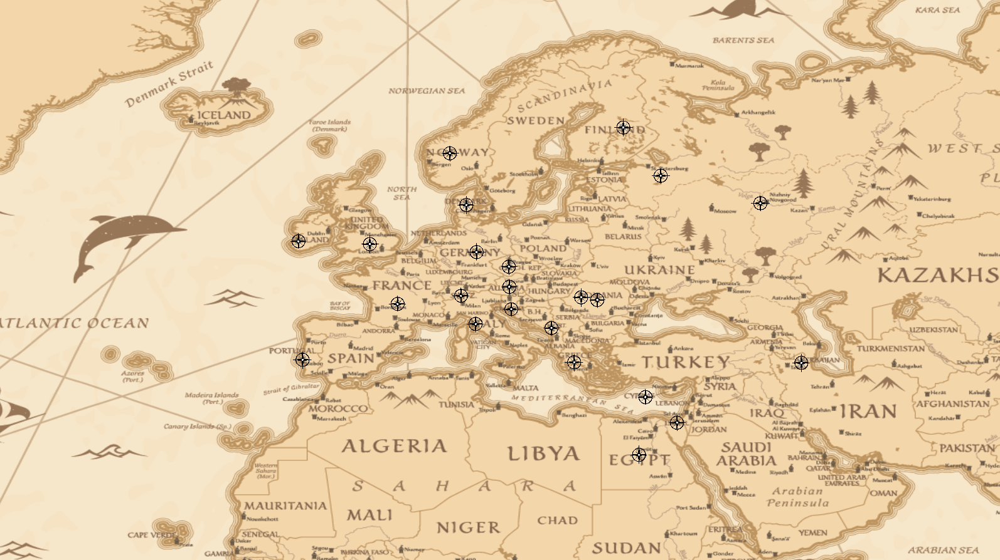
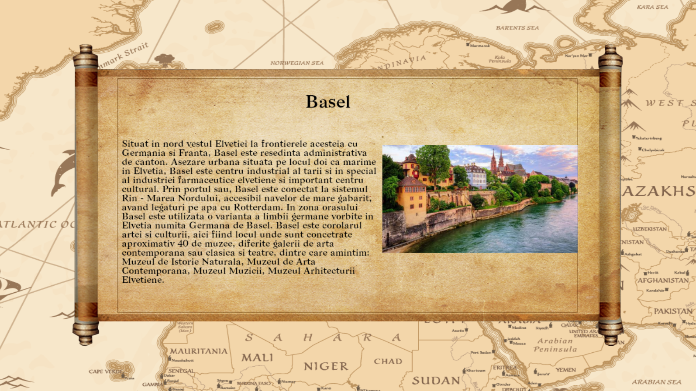
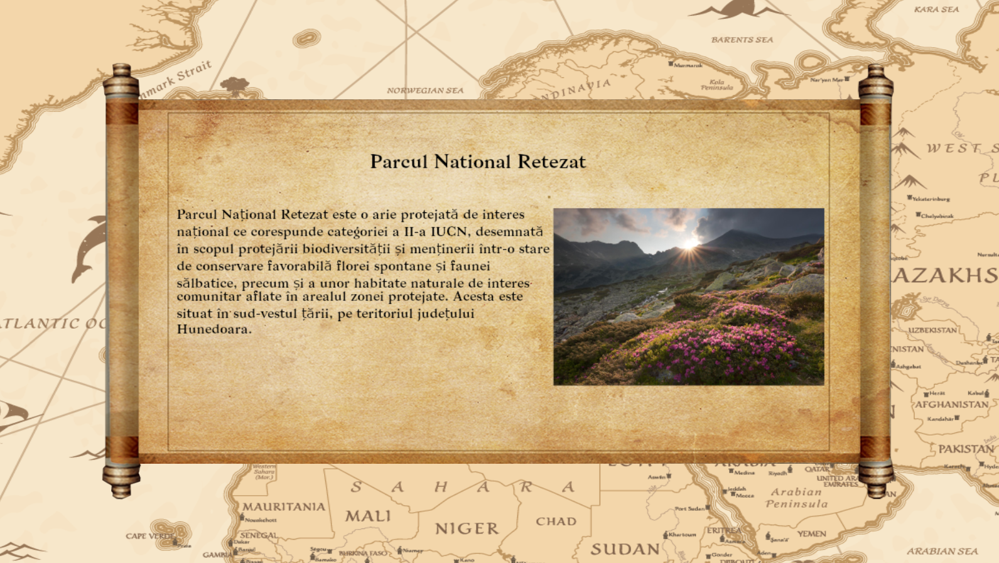

# Terra-Nova 
Terra Nova application is designed for the curious who want to improve their general knowledge by exploring previously unheard-of places.

# Technologies used
* C++
* OpenGL
* Lua
* Stb-Image
* GLM
* Premake5

# Building
run generate_project.bat

# Screenshots

